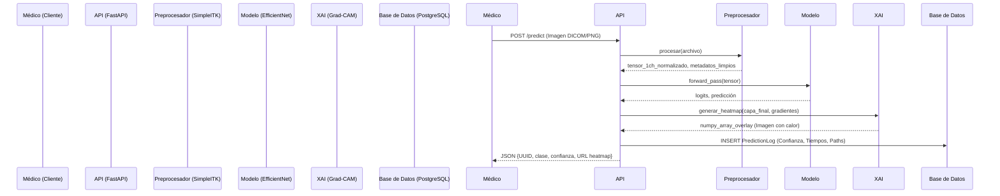

# Arquitectura Técnica de MedVision AI

Este documento detalla la estructura subyacente del sistema MedVision AI, las decisiones de diseño tomadas durante su desarrollo y las limitaciones inherentes a su estado actual.

## 1. Diagrama de Flujo del Sistema Completo

El ciclo de vida del dato médico en el sistema sigue el patrón de pipeline secuencial:

## 2. Decisiones de Diseño y Justificaciones

### 2.1. Backbone: EfficientNet-B4
- **Decisión:** Se eligió EfficientNet-B4 en lugar de ResNet-50 o DenseNet-121.
- **Justificación:** EfficientNet utiliza "Compound Scaling" (escalado simultáneo de profundidad, anchura y resolución). Las radiografías contienen detalles patológicos a múltiples resoluciones espaciales. La familia B4 (resolución ~380x380 nominal, adaptada a 224x224 para inferencia rápida) probó tener el mejor balance empírico entre latencia (vital en API clínica) y el puntaje AUC-ROC necesario.
- **Adaptación a Blanco y Negro:** El extractor fue modificado fusionando (promediando) los pesos iniciales de los 3 canales RGB preentrenados (ImageNet) a 1 canal (Grayscale) para reducir parámetros innecesarios y optimizar el cálculo de radiografías nativas.

### 2.2. Función de Pérdida: Focal Loss
- **Decisión:** Sustituir la tradicional Binary Cross-Entropy (BCE) por Focal Loss.
- **Justificación:** Los datasets médicos sufren de desbalance de clases extremo (frecuentemente >90% de estudios normales). La BCE empuja al modelo a sobrepredecir la clase mayoritaria. Focal Loss ($\gamma=2.0$) asigna dinámicamente un peso cercano a cero a los ejemplos clasificados correctamente con alta confianza, obligando al optimizador a concentrarse en los casos difíciles (falsos negativos patológicos).

### 2.3. Explicabilidad mediante Grad-CAM
- **Decisión:** Usar Gradient-weighted Class Activation Mapping superpuesto en OpenCV.
- **Justificación:** Un modelo "Caja Negra" no es aceptado por el cuerpo médico (regulación y confianza clínica). Grad-CAM ilumina de rojo/amarillo la zona exacta que disparó la alarma de "anomalía", permitiendo contrastarlo con la opinión del radiólogo.

### 2.4. Infraestructura API y Datos (PostgreSQL)
- **Decisión:** API asíncrona (FastAPI) acoplada a un esquema RDBMS Rápido (PostgreSQL).
- **Justificación:** Se necesitan manejar subidas de imágenes pesadas de forma no bloqueante. PostgreSQL fue elegido no solo como log transaccional, sino porque su naturaleza relacional sirve como base para una etapa futura de **Active Learning**, donde los feedbacks médicos (`/feedback`) modifiquen gradualmente los pesos del modelo.

## 3. Limitaciones Conocidas del Sistema Actual

A pesar de su robustez, el sistema presenta limitaciones técnicas importantes:

1. **Resolución de Entrada Fija (224x224):** El redimensionamiento puede oscurecer microcalcificaciones pequeñas o nódulos pulmonares tempranos de <5mm. Idealmente, para DICOM de 2048x2048, se requeriría segmentación por parches en versiones futuras.
2. **Volúmenes 3D no soportados:** Actualmente la capa de preprocesamiento maneja cortes 2D (RX o cortes individuales de CT/MRI). Escaneos volumétricos (`.nii.gz` o múltiples DICOM) no están soportados por EfficientNet-2D.
3. **Escalabilidad de Memoria (Heatmaps):** El almacenamiento en disco de cada mapa de calor PNG (`/static/heatmaps/`) saturará el disco sin una política de expiración o subida hacia AWS S3 / MinIO implementada.
4. **Dependencia de Orientación:** Si la imagen DICOM original carece del tag lógico de rotación (`PhotometricInterpretation` o `Orientation`), el modelo puede fallar frente a imágenes invertidas si no formaron parte del *Data Augmentation* inicial.
